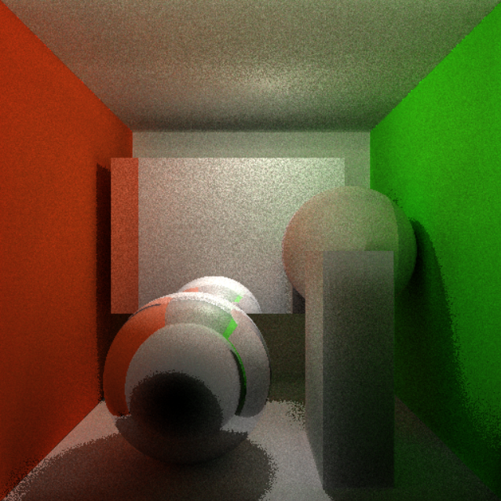
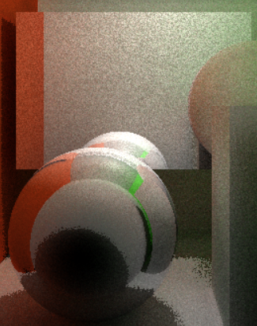
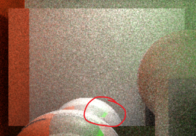
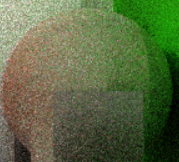
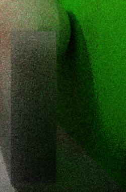

# WebGL光线追踪Demo

- 点击`html`文件即可运行

## 图像内容说明

- 

- 图中为采用光线追踪渲染的Cornell Box

- 共有五个图元：Cornell Box、左下角的不锈钢材质球、后方的不锈钢材质长方体、右下角的哑光材质长方体、右方的哑光材质球

- 本想添加更多图元，但是感觉场景中太过拥挤，且当前图元已经能很好的体现光线追踪特性，故维持现状

- 光源在盒子顶部，通过给光源设置一个大小来实现**软阴影**。

- 图像中颜色、软阴影部分噪点较多，这是因为GLSL没有伪随机数生成函数，而我也没有找到一个**足够随机**的随机函数，所以多次取样只能轻微改善图像的模糊状态，但是不能达到一个光滑的效果。

- ### 光线追踪特性体现

	- 不锈钢材质物体反射周围环境
		- 

	- 绿墙的光线反射到球上再反射到长方体上再反射到视点中，这是环境贴图做不到的
		- 

	

	- 哑光球的左右两边的颜色辉映效果，左边偏红色右边偏绿色
		- 
	- 右下角光源照不到的地方通过反射光照亮
		- 

## 代码文件说明

- `beity_webgl_ray_tracing.js`: js代码，调用`webgl`绘制图像

- `BeityWebGLRayTracing.html`: 里面有两个代码块，一个是`vertex shader`, 一个是`fragment shader`. 这两部分代码和相应的`glsl`文件中的代码完全一致，只是由于`js`没办法调用本地文件所以只能复制到`html`里

- `vertex_shader.glsl`: 码如其名
- `fragment_shader.glsl`: 码如其名
- `sylvester.src.js`: 一个开源的矩阵、向量运算工具。但是在本作业中就用到了向量减法（本来以为会用到矩阵乘法求逆什么的，现在还没用上）
- `glUtils.js`: 网上的一个人对`sylvester.src.js`的一个补充，增加了lookAt等功能。在本作业中**没有用到**，可能未来会用上。
- `README.md`: 就是我了！

## 代码说明

- ### 思路说明

  - 光线追踪是逐像素计算的，因此没办法用传统的绘制流水线直接绘制。

  - 采用的思路是：用传统流水线画两个三角形组成的正方形，然后在`fragment shader`中对这个正方形的每一个像素计算光线方向和最终的颜色

  - #### 建模方法：

  	- 隐式建模
  	- 用球心和半径确定一个圆，用两个角坐标确定长方体。在求交运算中使用这些信息判断是否相交

  - #### 在`fragment shader`中获取像素位置的方法

  	- 在`vertex shader`中传入四个向量，分别是由视点看向盒子的左前下、右前下、右前上、左前上四个角的向量：`ray00、ray01、ray11、ray10`

  	- 设置一个`varying`变量`initialRay`，在`vertex shader`中根据`vertex`的位置给`initialRay`赋值

  		- ```glsl
  			if (vertex.x < 0.0 && vertex.y < 0.0)
  			        initialRay = ray00;
  			else if (vertex.x < 0.0 && vertex.y > 0.0)
  			    initialRay = ray01;
  			else if (vertex.x > 0.0 && vertex.y > 0.0)
  			    initialRay = ray11;
  			else if (vertex.x > 0.0 && vertex.y < 0.0)
  			    initialRay = ray10;
  			```

  	- 在`fragment shader`中的`varying`变量的值是根据三角形三个顶点的`varying`变量值线性插值得到的，而我们的两个三角形组成的是占满画面的正方形，因此逐像素调用`fragment shader`时，`initialRay`这个变量将会是由视点指向当前像素的向量。

  - #### calculateColor函数解析

  	- `calculateColor`用来在`fragment shader`中计算当前像素的颜色
  	- 光线单次反射的颜色计算：
  		- 首先计算跟场景中的所有图元进行求交运算，并获取所有结果的最小值：如果最小值为正无穷，就说明没有碰到任何东西，返回一个背景色。
  		- 根据求得的最小值确定是与哪个图元相交，并根据图元的材质不同计算法线、与漫反射光强度。
  		- 漫反射光强度使用`getDiffuseIntensity`函数计算：采用局部光照模型，直接根据交点和光源的连线、法线计算光强。同时还要计算连线是否有图元遮挡，如果有遮挡返回0.
  		- 将光强与物体的表面颜色相乘，就可以得到本次反射的颜色了。
  		- 下一条光线方向的计算：
  			- 如果是模糊材质，就采用`cosineWeightedDirection`函数随机选择一个方向
  			- 如果是不锈钢材质，就用法线计算反射光作为下一个方向
  	- 光线多次反射的颜色计算
  		- glsl不能写递归函数，只能通过循环实现光线追踪。因此，需要**将更早的碰撞点的影响传递给之后的碰撞点**
  		- 使用一个叫做`colorMask`的变量来**累积更早的碰撞点对颜色的影响**，使用`accumulatedColor`来**累积每一次碰撞的颜色**
  		- 一开始`colorMask`是一个`vec3(1.0, 1.0, 1.0)`, 每次与图元相交的时候，`colorMask  = colorMask \* surfaceColor，surfaceColor`是**当前碰撞点的颜色**。
  		- 每一次碰撞更新`accumulatedColor += colorMask * diffuseIntensity`。
  		- 合理性：
  			- **颜色**可以看作是对光的**吸收**，因此单独一个点只考虑漫反射光的颜色应该是当前点的之后的碰撞点反射出来的光线，会被之前的碰撞点二次吸收，因此第二次碰撞点对最终颜色的贡献值应当是`surfaceColor(第一次) * （surfaceColor(当前) * diffuseIntensity(当前) ）`，第三次碰撞点对颜色的贡献值是`surfaceColor(第一次) * surfaceColor(第二次) * surfaceColor(当前) * diffuseIntensity(当前) ）`
  			- 在循环体中，用`colorMask`变量计算诸如`“surfaceColor(第一次) * surfaceColor(第二次) * surfaceColor(当前) ”`的值

  - #### 软阴影的实现

  	- 在每一像素的光源都用随机算法改变位置，从而在整体上让点光源有了**大小**，有了大小的光源就能很自然的显示软阴影的效果了。

- 声明：

	- 本项目代码结构与：*http://madebyevan.com/webgl-path-tracing/*非常相像，因为就是参照这个人的代码学习如何进行光线追踪。
	- 球相交、长方体相交是借鉴自该代码，但其实这些是比较成熟的算法，没有多少可以改动的地方。
	- `cosineWeightedDirection`函数借鉴自：*http://www.rorydriscoll.com/2009/01/07/better-sampling/*。我尝试着用完全随机的办法对漫反射光线方向进行采样，但是效果并不好，故换成了这个。

